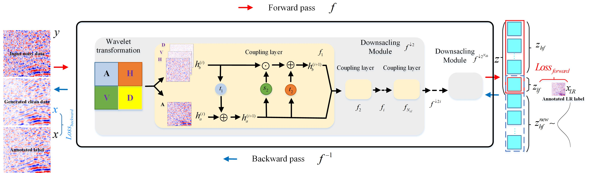
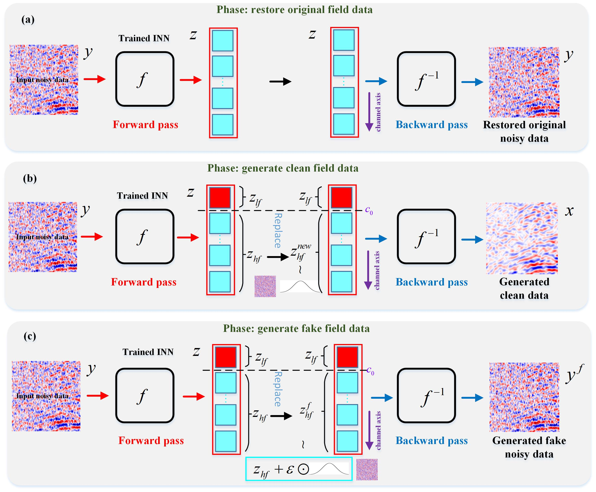
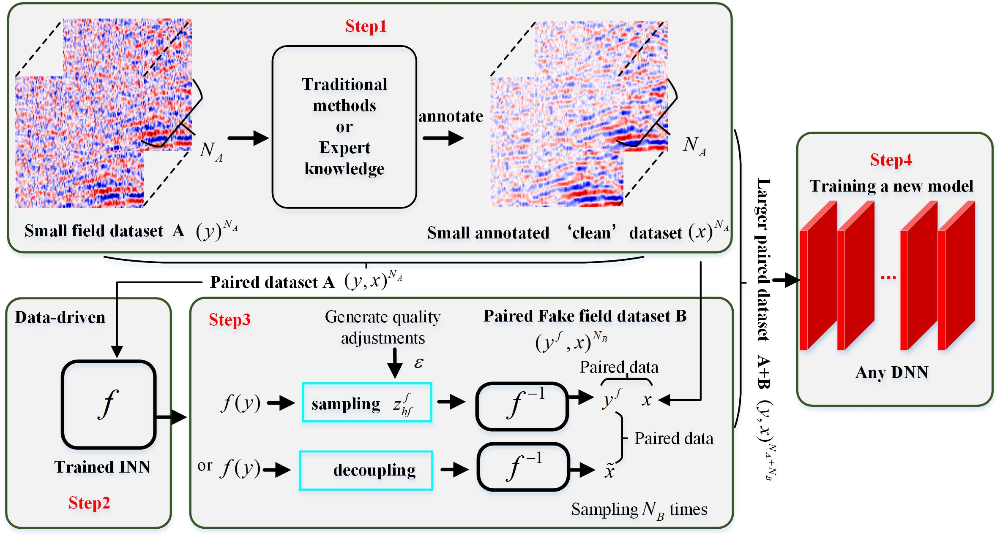

# 2023 TGRS Learning to Decouple and Generate Seismic Random Noise via Invertible Neural Network
This repo contains the official implementation for the paper [Learning to Decouple and Generate Seismic Random Noise via Invertible Neural Network](https://ieeexplore.ieee.org/document/10227303). 

by Chuangji Meng, Jinghuai Gao, Yajun Tian, Zhen Li.


## Get Started
Training and testing codes are in ['codes/'](./codes/). Please see ['codes/README.md'](./codes/README.md) for basic usages.
The model configuration file is in the options folder and ends with .yml, e.g., 'options/train/train_InvDN-mcj.yml'

We present six model types: 'InvDN','InvDN_C','Unet','Unet_aug','DnCNN','DnCNN_aug', see 'models/\__init\__.py'
The symbol after the underscore indicates that the model class incorporates the trained INN, which can generate samples online for data augmentation and 
train together with the original paired data. Similarly, readers can refer to and write class files for other networks.

Paired noisy-clean datasets can be obtained by expert annotation or other annotation methods (such as [fxdecon+orth](https://github.com/mengchuangji/SRNGF/tree/main/seispro/localortho) in the paper).
Please refer to [this repo](https://github.com/mengchuangji/SRNGF/tree/main/seispro/localortho) for how to write paired datasets into hdf5 files. Of course, readers can customize dalaloader for any file format.

## Training, 

This is an example of schematic diagram of the training of INN for signal-noise decoupling.


Prepare a small paired dataset (target dataset) for training, model type is 'InvDN', obtain a trained INN.
```bash
python train-mian.py 
```

## Generation 
Schematic diagram of the trained INN for signal-noise decoupling and fake field data generation.


Signal-to-noise decoupling and fake-noise generation using trained INN, using the following code,
```bash
python test-***.py 
```
For Signal-to-noise decoupling, use test-SEGY-***.py, and the function ***_test(model, opt)
For the calculation of AKLD, use test-SEGY-***.py, and the function AKLD(model, opt)
For the generation, analysis, storage, and visualization of fake-noisy data use test_generate_***.py, 
then, the reader uncomments the required functions as needed, e.g., generate_aug_dataset(model, opt)

## Downstream applications
Schematic diagram of fake-field data generated for downstream tasks


Retrain a new downstream model, such as INN, Unet, DnCNN (the corresponding model classes are INN_C, Unet_aug, DnCNN_aug),
using the previously trained INN and its augmented data 
```bash
python train-***-aug.py 
```

## Acknowledgement
The code is modified from [Invertible Image Rescaling](https://github.com/pkuxmq/Invertible-Image-Rescaling) and [Invertible denoising network](https://github.com/Yang-Liu1082/InvDN). 
The noise generation methods used for comparison are from [VI-non-IID](https://github.com/mengchuangji/VI-Non-IID) and [DANet](https://github.com/zsyOAOA/DANet) respectively.
Scripts and methods for seismic data processing are from [seispro](https://github.com/mengchuangji/SRNGF/tree/main/seispro)
The metric 'average Kullback–Leibler divergence (AKLD)' used to evaluate the generated noise is derived from [DANet](https://github.com/zsyOAOA/DANet).
Thanks for their contributions. If you find their code is helpful, please also cite the corresponding paper. 

## References

If you find the code/idea useful for your research, please consider citing

```bib
@ARTICLE{meng2024stochastic,
  author={Meng, Chuangji and Gao, Jinghuai and Tian, Yajun and Chen, Hongling and Zhang, Wei and Luo, Renyu},
  journal={IEEE Transactions on Geoscience and Remote Sensing}, 
  title={Stochastic Solutions for Simultaneous Seismic Data Denoising and Reconstruction via Score-Based Generative Models}, 
  year={2024},
  volume={62},
  number={},
  pages={1-15},
  keywords={Noise reduction;Data models;Inverse problems;Noise;Mathematical models;Training;Stochastic processes;Denoising;Langevin dynamics;posterior sampling;reconstruction;score-based generative models (SGMs);stochastic solutions},
  doi={10.1109/TGRS.2024.3421597}}
```

and/or our earlier work on non-IID noise modeling

```bib
@ARTICLE{meng2022seismic,
  author={Meng, Chuangji and Gao, Jinghuai and Tian, Yajun and Wang, Zhiqiang},
  journal={IEEE Transactions on Geoscience and Remote Sensing}, 
  title={Seismic Random Noise Attenuation Based on Non-IID Pixel-Wise Gaussian Noise Modeling}, 
  year={2022},
  volume={60},
  number={},
  pages={1-16},
  keywords={Attenuation;Noise measurement;Gaussian noise;Data models;Noise reduction;Noise level;Training;Deep learning (DL);noise estimation;noise modeling;non-independently identically distribution (IID);seismic random noise attenuation (NA);variational inference (VI)},
  doi={10.1109/TGRS.2022.3175535}}
```


## Contact
If you have any problem about our code, feel free to contact <4120105144@stu.edu.xjtu.cn>, <2279767412@qq.com> or describe your problem in Issues
